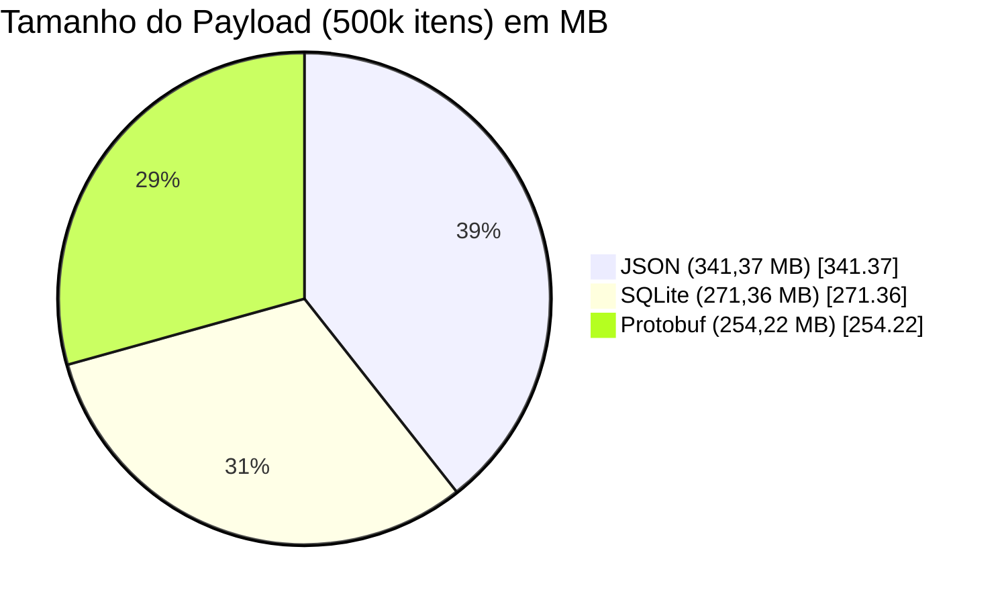
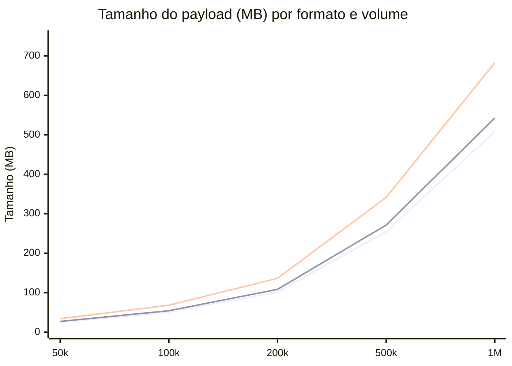
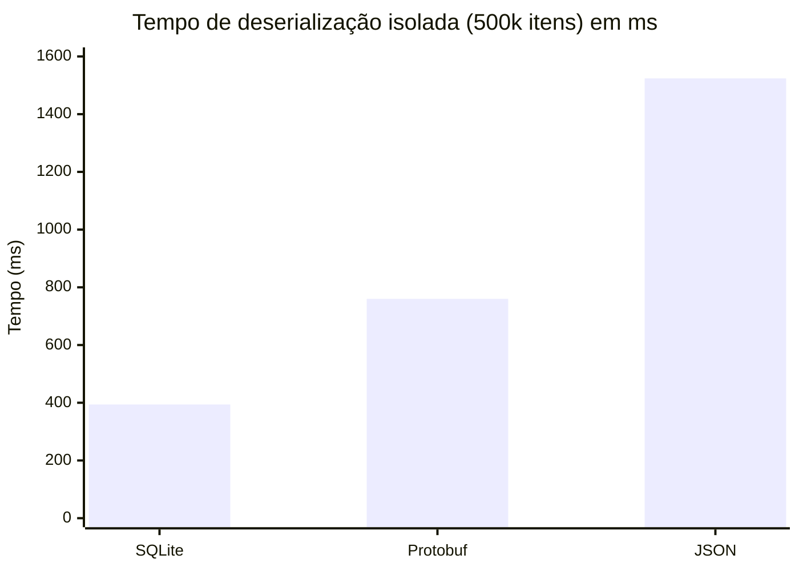
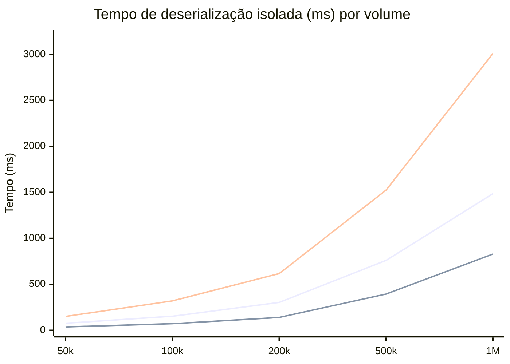

# Resumo Técnico: Análise Comparativa e Decisão Arquitetural para Sincronização Mobile

A implementação de um sistema **offline-first** para zonas rurais impõe restrições severas de largura de banda e capacidade de processamento nos dispositivos clientes. Para determinar o formato ideal de transmissão e armazenamento de dados espaciais (matrizes), realizou-se um benchmark avaliando três formatos estruturais: **Protocol Buffers (.bin)**, **SQLite (.sqlite)** e **JSON**.

Os testes consideraram cargas variando de **50.000 a 1.000.000** de registros, contendo **16 atributos por entidade**, simulando o pior cenário de transferência e alocação de memória.

---

## 1. Consumo de Banda e Tamanho de Payload

O gargalo principal em operações de campo é a **transferência de rede**. A análise de 500.000 registros evidencia a ineficiência do JSON, que atingiu **341,37 MB**, contra **254,22 MB** do Protobuf e **271,36 MB** do SQLite.

A diferença de aproximadamente **87 MB** entre JSON e Protobuf ocorre devido à redundância inerente ao JSON, que transmite as chaves de texto plano repetidamente para cada um dos 500.000 objetos. Em uma conexão 3G instável de 1 Mbps, essa diferença representa **minutos adicionais** de transferência, elevando substancialmente o risco de falha por timeout.

### Escala: tamanho do payload por volume de dados

O gráfico abaixo mostra como o tamanho do payload escala com o número de itens (50k a 1M), mantendo-se a vantagem do Protobuf em todos os volumes.

---

## 2. Custo de Processamento no Cliente (Parse e Extração)

O tempo necessário para **converter os dados recebidos da rede em estruturas de memória utilizáveis** pelo aplicativo (por exemplo, extrair latitude e longitude para renderização) dita o bloqueio da interface do usuário (UI) e o consumo de bateria.

Na **extração isolada** (parse puro, sem latência de rede) de 500.000 registros:

| Formato  | Tempo (ms) |
|----------|------------|
| SQLite   | 394        |
| Protobuf | 760        |
| JSON     | 1524       |

O **SQLite** obteve o menor tempo absoluto porque sua arquitetura orientada a linhas e execução nativa em C permite a **projeção exata das colunas** requeridas (`SELECT latitude, longitude`), ignorando o parsing e a alocação de memória para os outros 14 campos na heap da aplicação. O **JSON** exigiu a alocação do objeto completo em memória antes da extração das propriedades, **dobrando o tempo de execução** em relação ao Protobuf.

### Escala: tempo de parse por volume

---

## 3. Definição Arquitetural Híbrida

A análise dos dados **invalida a adoção de uma estratégia única** de formatação, apontando para uma **arquitetura híbrida** focada em eficiência de hardware e rede:

### Carga inicial (First Sync / Snapshot): **SQLite**

Para a sincronização inicial, onde a **totalidade do banco de dados** (centenas de milhares de registros) precisa ser transferida para um dispositivo virgem, o sistema servirá um arquivo **.sqlite** pré-processado pelo backend. O download deste arquivo **anula completamente** o custo de INSERTs iterativos, transações e reconstrução de índices no dispositivo móvel. O aplicativo apenas fará o download e **acoplará o arquivo ao motor interno** de banco de dados, com custo de CPU tendendo a zero para a persistência.

### Sincronização incremental (Delta Sync): **Protobuf**

Para as **sincronizações diárias de atualização**, o volume de dados alterados é reduzido (dezenas a centenas de matrizes). Fazer o download de um banco SQLite completo de 271 MB para atualizar 50 registros **inviabiliza a operação**. Neste fluxo, o backend fornecerá apenas as **entidades modificadas** empacotadas via **Protocol Buffers**. O cliente realizará o download de um payload mínimo (frequentemente na ordem de poucos kilobytes) e executará operações de **UPSERT pontuais** no banco SQLite local.

Esta divisão garante a **máxima eficiência na renderização inicial** por meio do SQLite e o **menor impacto na largura de banda** durante o ciclo de vida do aplicativo por meio do Protobuf.

---

## Referência dos dados

Os números deste resumo vêm dos benchmarks registrados em `resultados-benchmark.md`, com modelo de 16 campos por item (valueA, valueB, label, latitude, longitude, altitude, createdAt, updatedAt, description, code, category, status, count, score, metadata). Ambiente: Java 17, Spring Boot, PostgreSQL 16, MinIO; scripts Python em `scripts/benchmark_*.py`.
