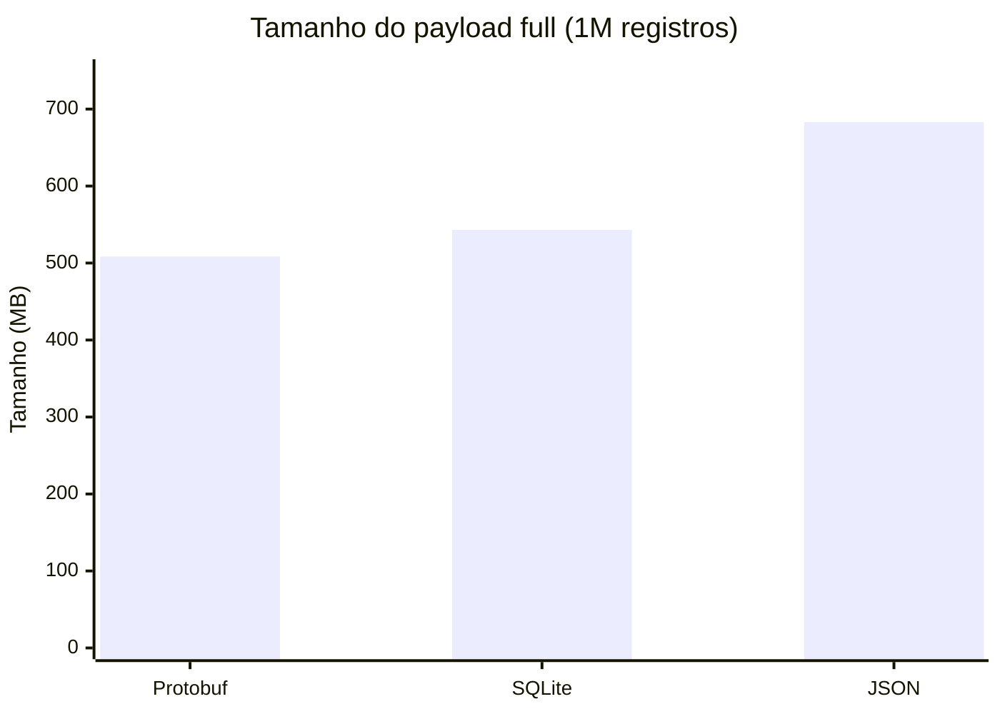
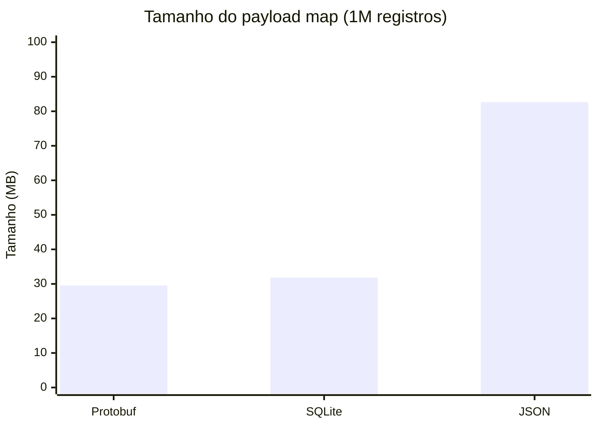
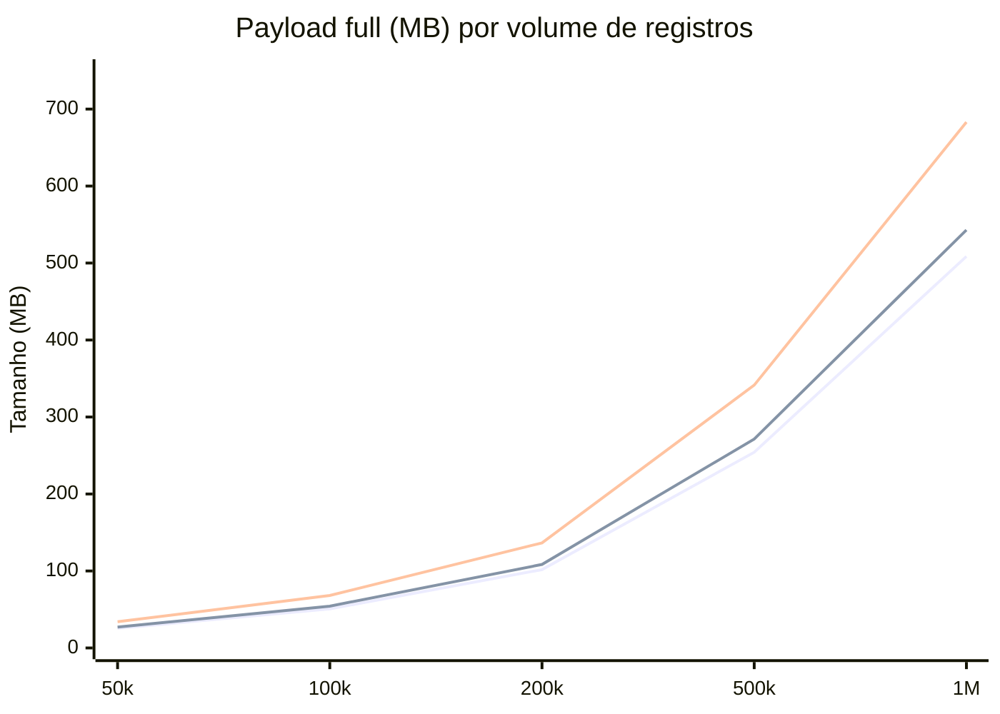
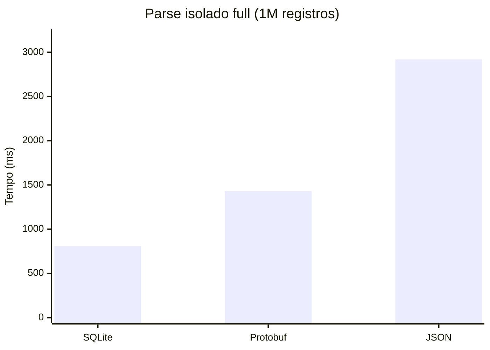
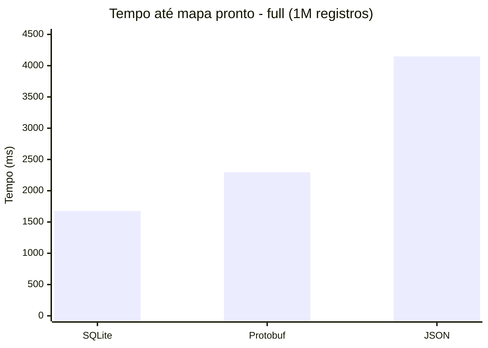
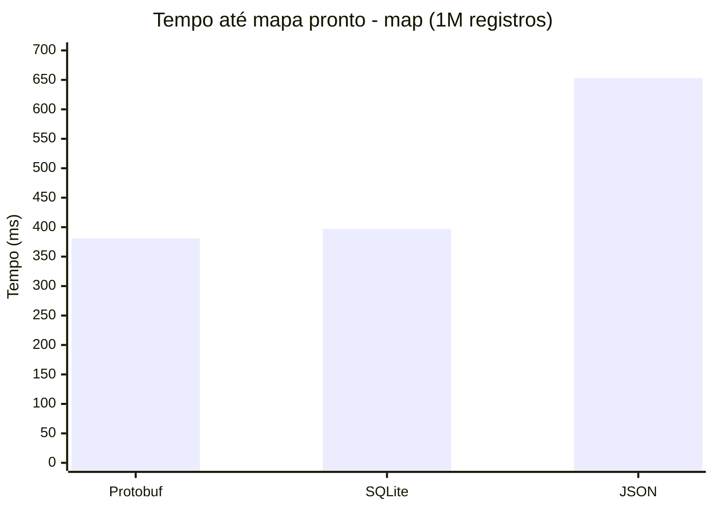
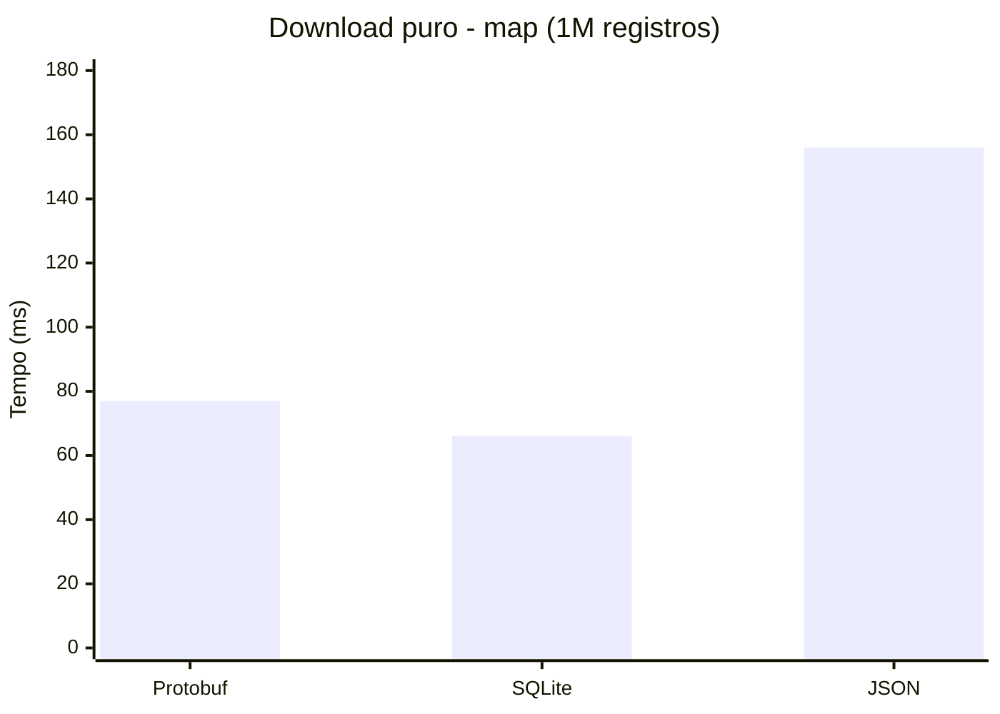
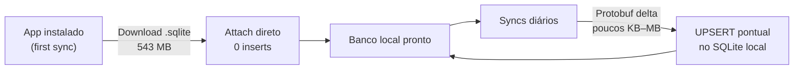

# Resumo Técnico: Protobuf vs SQLite vs JSON para Sincronização Offline-First

## Contexto

Uma aplicação mobile **offline-first** para zonas rurais precisa sincronizar dados espaciais (matrizes de árvores com latitude/longitude e metadados) entre servidor e dispositivos com **conexão instável e limitada**. A pergunta central é: **qual formato usar para transferir e persistir centenas de milhares de registros no celular do campo?**

Três candidatos foram avaliados: **Protocol Buffers (Protobuf)**, **SQLite** e **JSON**.

---

## Como foi testado

### Ambiente

- **Backend:** Java 17, Spring Boot 3.3, PostgreSQL 16, MinIO (storage S3-compatível)
- **Modelo de dados:** 16 campos por registro (id, latitude, longitude, altitude, description, category, status, metadata, etc.)
- **Volumes testados:** 50.000 a 1.000.000 de registros
- **Scripts de benchmark:** Python com `requests`, `protobuf`, `sqlite3`, `json`

### Metodologia

Para garantir comparação justa, as medições foram **separadas por camada**:

1. **Tamanho do payload** — bytes gerados por formato, sem influência de rede.
2. **Download puro** — arquivos pré-gerados servidos via MinIO; mede só transferência.
3. **Parse isolado** — deserialização em memória sem rede; mede custo de CPU no cliente.
4. **Tempo até mapa** — ponta a ponta: request + download + parse + lista de `(lat, lng)` pronta.

Cada teste foi executado **5 vezes** e os resultados representam a **média**.

Dois perfis de payload foram medidos:
- **full** — todos os 16 campos (simula sync completo).
- **map** — apenas `id`, `latitude`, `longitude`, `updatedAt` (simula sync incremental para mapa).

---

## 1. Protobuf é significativamente mais leve

O primeiro dado que salta aos olhos é o **tamanho do payload**. O Protobuf codifica dados em binário compacto, sem repetir nomes de campo como o JSON faz a cada registro.

### Payload full (1M registros, 16 campos)

| Formato | Tamanho | vs Protobuf |
|---------|---------|-------------|
| **Protobuf** | **508,57 MB** | — |
| SQLite | 542,96 MB | +6,8% |
| JSON | 682,96 MB | **+34,3%** |

O JSON transfere **174 MB a mais** que o Protobuf para os mesmos dados. Em uma conexão 3G de 1 Mbps, isso representa **~23 minutos extras** de download — inaceitável no campo.

### Payload map (1M registros, 4 campos)

Quando o app precisa apenas de coordenadas para renderizar o mapa, o payload enxuto muda o cenário drasticamente:

| Formato | Tamanho | vs Protobuf |
|---------|---------|-------------|
| **Protobuf** | **29,55 MB** | — |
| SQLite | 31,83 MB | +7,7% |
| JSON | 82,65 MB | **+179,7%** |

O Protobuf e o SQLite ficam muito próximos em tamanho (~30 MB), enquanto o JSON quase triplica. Para sincronizações incrementais, isso é determinante.

### Como o tamanho escala com o volume

A diferença cresce linearmente: quanto mais dados, mais o JSON desperdiça banda repetindo `"latitude":`, `"longitude":`, `"description":` em cada objeto.

---

## 2. SQLite tem uma vantagem única: attach sem insert

Aqui está o ponto que muda a decisão para o **first sync**.

Quando o app é instalado pela primeira vez, o dispositivo precisa receber **todo o banco de dados**. Num cenário com 1M de registros, há duas abordagens:

**Abordagem A (Protobuf/JSON):** baixar o payload → deserializar → executar 1M de `INSERT`/`UPSERT` no SQLite local do celular. Isso significa parse + 1M de operações de escrita.

**Abordagem B (SQLite):** baixar o arquivo `.sqlite` → **substituir o arquivo local**. Custo de insert no cliente: **zero**.

O download do SQLite é ligeiramente maior que o Protobuf (+34 MB para 1M itens full), mas elimina completamente o custo de persistência no dispositivo. No first sync, o usuário **está com internet** (acabou de baixar o app), então gastar ~7% a mais de banda para pular 1M de inserts é uma troca excelente.

### Parse isolado no cliente (1M registros, full)

| Formato | Tempo de parse | vs SQLite |
|---------|---------------|-----------|
| **SQLite** | **808 ms** | — |
| Protobuf | 1.430 ms | +77% |
| JSON | 2.920 ms | **+261%** |

O SQLite é mais rápido no parse full porque sua engine nativa em C faz `SELECT` direto nas colunas necessárias, sem alocar todos os campos em memória. Mas o ponto principal é: **na abordagem "attach", nem esse parse é necessário** — o arquivo já *é* o banco.

### Tempo até mapa pronto (1M registros, full)

Este teste mede o caminho completo: download + parse + lista de pontos `(lat, lng)` pronta.

| Formato | Tempo total | Tamanho |
|---------|------------|---------|
| **SQLite** | **1.677 ms** | 543 MB |
| Protobuf | 2.295 ms | 509 MB |
| JSON | 4.148 ms | 683 MB |

O SQLite full entrega os dados prontos **37% mais rápido** que o Protobuf no cenário de carga completa, e com a vantagem de já ser o banco local sem necessidade de insert.

---

## 3. Depois do first sync: Protobuf para atualizações

Após a carga inicial, as sincronizações diárias movimentam **dezenas a centenas de registros modificados**, não o banco inteiro. Baixar 543 MB de SQLite para atualizar 50 árvores não faz sentido.

Nesse cenário, o servidor envia apenas os **registros alterados** em formato Protobuf (payload map/delta). O cliente deserializa e faz UPSERTs pontuais no SQLite local.

### Modo map (1M registros, 4 campos por item)

| Formato | Download (ms) | Parse (ms) | Tempo total (ms) | Tamanho |
|---------|--------------|-----------|-----------------|---------|
| **Protobuf** | **77 ms** | **364 ms** | **381 ms** | **29,55 MB** |
| SQLite | 66 ms | 362 ms | 397 ms | 31,83 MB |
| JSON | 156 ms | 547 ms | 653 ms | 82,65 MB |

No modo map, Protobuf e SQLite empatam em velocidade (~380-400 ms), mas o Protobuf mantém o **menor payload** (29,55 MB vs 31,83 MB). Com volumes menores de delta sync (centenas de registros), a diferença de banda fica ainda mais relevante: poucos KB de Protobuf vs dezenas de KB de JSON.

### Download puro map (1M registros)

O JSON leva o dobro do tempo para transferir — paga o preço de um payload quase 3x maior.

---

## Decisão arquitetural

| Cenário | Formato | Motivo |
|---------|---------|--------|
| **First sync** | **SQLite** | Download direto como banco local. Zero custo de insert. Usuário tem internet (acabou de instalar o app). |
| **Delta sync** | **Protobuf** | Menor payload possível. Parse rápido. Ideal para conexão instável no campo. |
| **Rotas online (com internet)** | **JSON** | Formato padrão das demais rotas da API quando há conectividade. |

### Por que essa combinação?

1. **SQLite no first sync** troca ~7% a mais de banda por **eliminar 100% do custo de persistência** no dispositivo. Com 1M de registros, evita-se executar 1M de INSERTs no celular.

2. **Protobuf no delta sync** garante o **menor consumo de banda** nas atualizações diárias, que acontecem em campo, com sinal fraco. O parse é rápido e o UPSERT pontual de dezenas de registros é trivial.

3. **JSON segue nas rotas online comuns** quando o app está com internet. Já **SQLite + Protobuf** ficam responsáveis por carregar e manter grandes volumes no celular para garantir robustez no offline.

---

## Referência

Os dados completos de todas as rodadas (50k a 1M, full e map, com detalhamento por camada) estão em `resultados-benchmark.md`. Ambiente: Java 17, Spring Boot 3.3, PostgreSQL 16, MinIO, Pop!_OS 22.04. Scripts em `scripts/benchmark_*.py`.
