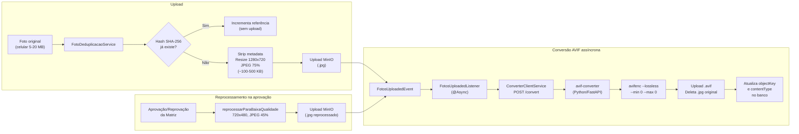

# Roteiro — Relatório Técnico: Catálogo de Matrizes

> Guia para coleta de dados, benchmarks e escrita do artigo final.

---

## 1. Resumo do Sistema

### 1.1 Contexto

O **Catálogo de Matrizes** é um sistema de gestão de árvores porta-sementes (matrizes) voltado à conservação e restauração ambiental. Permite que coletores registrem matrizes em campo (GPS, fotos, dados dendrométricos), analistas revisem e aprovem os registros, e administradores gerenciem usuários e notificações.

### 1.2 Stack

| Camada | Tecnologia |
|---|---|
| Backend / API | Java 21, Spring Boot 3, Spring Security (JWT) |
| Banco relacional | PostgreSQL 16 |
| Object Storage | MinIO (S3-compatível) |
| Serialização binária | Protocol Buffers 3 (protoc + protobuf-java) |
| Conversão de imagem | Microserviço Python 3.11 / FastAPI + libavif (`avifenc`) |
| Infraestrutura | Docker Compose (backend, PostgreSQL, MinIO, avif-converter) |

### 1.3 Público-alvo

- **Coletores em campo** — dispositivos mobile, frequentemente em zonas rurais com internet limitada ou inexistente.
- **Analistas / Administradores** — aplicação web, necessitam de visão geral de todas as matrizes e status de aprovação.

### 1.4 Requisitos-chave

1. **Offline-first** — o app mobile precisa funcionar sem conexão após a sincronização inicial.
2. **Economia de banda** — payloads mínimos para que syncs funcionem em 3G/edge.
3. **Armazenamento eficiente de fotos** — compressão sem perda perceptual, deduplicação.

---

## 2. Fluxos Técnicos

### 2.1 Sync Web — Snapshot + Incremental (Protobuf)

**Objetivo:** carregar todas as matrizes no mapa do frontend web o mais rápido possível e, depois, manter atualizado com custo mínimo.

#### Primeiro carregamento (snapshot)

```mermaid
sequenceDiagram
    participant Cron as SnapshotGeneratorService<br/>(cron 6h)
    participant PG as PostgreSQL
    participant MinIO as MinIO
    participant Frontend as Frontend Web

    Note over Cron: A cada 6h (configurável)
    Cron->>PG: findAllComEspecie()
    PG-->>Cron: List&lt;Matriz&gt; (todas, com espécie)
    Cron->>Cron: Serializa MatrizFrontendResponse (Protobuf)
    Cron->>MinIO: Upload data_web.bin

    Frontend->>MinIO: GET /api/v1/sync/snapshot/matrizes/web
    MinIO-->>Frontend: data_web.bin (application/octet-stream)
    Frontend->>Frontend: Deserializa com protobuf.js
```

**Schema Protobuf — `MatrizFrontendResponse`** (12 campos por matriz):

```protobuf
message MatrizFrontend {
    int64  id               = 1;
    double latitude          = 2;
    double longitude         = 3;
    int64  especie_id        = 4;
    string nome_cientifico   = 5;
    string nome_popular      = 6;
    double dap               = 7;
    double altura            = 8;
    string municipio         = 9;
    string estado            = 10;
    string status            = 11;
    bool   em_monitoramento  = 12;
}
```

#### Sincronizações seguintes (incremental)

```mermaid
sequenceDiagram
    participant Frontend as Frontend Web
    participant API as ProtobufSyncService
    participant PG as PostgreSQL

    Frontend->>API: GET /sync/incremental/matrizes/web?since=1707840000
    API->>PG: findModificadasDesdeComEspecie(since, uf)
    PG-->>API: List&lt;Matriz&gt; (somente deltas)
    API->>API: Serializa MatrizFrontendResponse (Protobuf)
    API-->>Frontend: byte[] (application/octet-stream)
    Note over Frontend: Merge local com dados em memória
```

- `since` é um timestamp Unix (segundos) retornado pelo header `X-Server-Current-Time` da request anterior.
- Se `since = 0` ou muito antigo, o endpoint se comporta como sync completo (retorna tudo).

---

### 2.2 Sync Mobile — Snapshot + Incremental (Protobuf)

**Objetivo:** fornecer apenas o mínimo (id, lat, long) para que o app mobile renderize pontos no mapa offline.

#### Por que o payload mobile é diferente

| Aspecto | Web | Mobile |
|---|---|---|
| Campos por matriz | 12 | 4 (id, lat, long, last_modified) |
| Filtro de status | Todas (inclui PENDENTE) | Apenas APROVADAS |
| Filtro por UF | Sim (UF do usuário) | Sim (UF do usuário) |
| Caso de uso | Mapa com dados completos | Mapa offline com pontos |

#### Primeiro carregamento (snapshot)

```mermaid
sequenceDiagram
    participant Cron as SnapshotGeneratorService<br/>(cron 6h)
    participant PG as PostgreSQL
    participant MinIO as MinIO
    participant Mobile as App Mobile

    Cron->>PG: findAllAprovadas()
    PG-->>Cron: List&lt;Matriz&gt; (aprovadas)
    Cron->>Cron: Serializa SyncResponse (Protobuf)
    Cron->>MinIO: Upload data_mobile.bin

    Mobile->>MinIO: GET /api/v1/sync/snapshot/matrizes/mobile
    MinIO-->>Mobile: data_mobile.bin
    Mobile->>Mobile: Persiste localmente (SQLite/Room)
```

**Schema Protobuf — `SyncResponse`** (4 campos por matriz):

```protobuf
message MatrizMobile {
    int64  id                       = 1;
    double latitude                  = 2;
    double longitude                 = 3;
    int64  last_modified_timestamp   = 4;
}
```

#### Incremental

```
GET /api/v1/sync/incremental/matrizes/mobile?since=<timestamp>
```

Mesma lógica: retorna apenas matrizes aprovadas modificadas após `since`, filtradas pela UF do usuário.

---

### 2.3 Download SQLite (alternativa offline)

Para mobile, também é possível baixar um banco SQLite pré-populado diretamente:

```
GET /api/v1/sync/snapshot/matrizes/sqlite   → matrizes_MG.db
GET /api/v1/sync/snapshot/especies          → especies.db
```

O `SQLiteGeneratorService` consulta PostgreSQL, cria um `.db` em memória/disco com tabelas simplificadas, executa `VACUUM` e retorna o arquivo. O mobile pode abri-lo diretamente sem parsing.

---

### 2.4 Fluxo da Conversão AVIF

**Objetivo:** reduzir drasticamente o tamanho das fotos armazenadas e servidas sem perda perceptual de qualidade.

#### Pipeline completo



#### Etapas de redução

| Etapa | Resolução | Qualidade | Tamanho típico |
|---|---|---|---|
| Foto original (celular) | 4000x3000+ | 100% | 5–20 MB |
| JPEG processado (upload) | 1280x720 | 75% | 100–500 KB |
| AVIF lossless (sobre o JPEG) | 1280x720 | lossless | 50–300 KB |
| JPEG reprocessado (pós-aprovação) | 720x480 | 45% | 30–100 KB |
| AVIF lossless (sobre o reprocessado) | 720x480 | lossless | 15–60 KB |

#### Deduplicação SHA-256

Fotos idênticas (mesmo conteúdo binário) produzem o mesmo hash. Se o hash já existe no banco, o sistema apenas incrementa `referencia_count` sem duplicar o upload nem a conversão. Economia de armazenamento e processamento.

---

## 3. Estudo Comparativo: Protobuf (.bin) vs JSON vs SQLite

### 3.1 Cenários de teste — Carga inicial (snapshot)

**Dataset:** matrizes com dados completos (12 campos) para web, simplificados (4 campos) para mobile.

| N (matrizes) | Formatos a comparar |
|---|---|
| 100 | JSON, Protobuf .bin, SQLite .db |
| 500 | JSON, Protobuf .bin, SQLite .db |
| 1.000 | JSON, Protobuf .bin, SQLite .db |
| 5.000 | JSON, Protobuf .bin, SQLite .db |
| 10.000 | JSON, Protobuf .bin, SQLite .db |

### 3.2 Métricas a coletar

#### A) Tamanho do payload (bytes)

| Formato | Como medir |
|---|---|
| **JSON** | Criar endpoint temporário que retorna a mesma lista de matrizes em JSON; medir `Content-Length` ou `wc -c` no body salvo |
| **Protobuf** | Medir tamanho do `data_web.bin` / `data_mobile.bin` após geração pelo cron |
| **SQLite** | Medir tamanho do `.db` gerado por `SQLiteGeneratorService` |

> Comparar os 3 para o mesmo N, montar gráfico de barras agrupado.

#### B) Tempo de resposta (ms) — servidor

| Formato | O que medir |
|---|---|
| **JSON** | Tempo de serialização Jackson (endpoint REST) |
| **Protobuf snapshot** | Custo zero na request (pré-gerado); medir separadamente o tempo do cron `generateAndUploadSnapshots` |
| **Protobuf incremental** | Tempo da query + serialização Protobuf |
| **SQLite** | Tempo de geração completa (query + escrita SQLite + VACUUM) |

> Medir com `curl -o /dev/null -w "%{time_total}"` executado 10x. Calcular média e desvio padrão.

#### C) Processamento no cliente

| Formato | O que medir |
|---|---|
| **JSON** | `JSON.parse()` no browser / `Gson.fromJson()` no mobile — tempo em ms |
| **Protobuf** | Deserialização com `protobuf.js` (web) ou classe gerada (mobile) — tempo em ms |
| **SQLite** | `openDatabase()` + `SELECT * FROM matriz_mobile` (mobile) — tempo em ms |

#### D) Custo de rede vs frequência

| Formato | Característica |
|---|---|
| **Protobuf snapshot** | Gerado a cada 6h; payload grande mas pré-computado; download instantâneo do MinIO |
| **Protobuf incremental** | Payload pequeno (só deltas); gerado sob demanda; custo de query proporcional a mudanças |
| **SQLite** | Payload grande (inclui schema); gerado sob demanda; overhead de criação de índices |

### 3.3 Comparativo incremental (delta sync)

#### Cenários

| Mudanças desde o último sync | Formatos a comparar |
|---|---|
| 0 (nenhuma mudança) | Protobuf incremental, JSON incremental, re-download SQLite |
| 10 | Protobuf incremental, JSON incremental, re-download SQLite |
| 100 | Protobuf incremental, JSON incremental, re-download SQLite |
| 1.000 | Protobuf incremental, JSON incremental, re-download SQLite |

#### Métricas

- **Tamanho da resposta** — bytes transferidos em cada formato
- **Tempo de resposta** — ms no servidor
- **Complexidade de merge no cliente** — descrever qualitativamente:
  - Protobuf: merge trivial (substituir/inserir registros por id)
  - JSON: merge trivial (mesmo princípio)
  - SQLite: re-download completo ou implementar diff/merge no banco local (complexidade alta)

#### Conclusão esperada

Para cenários com poucas mudanças (0–100), o incremental Protobuf deve apresentar payload ordens de grandeza menor que re-download SQLite, com tempo de resposta desprezível.

### 3.4 Metodologia — como medir

#### Script de benchmark (sugestão)

```bash
#!/bin/bash
# benchmark_sync.sh — executa testes de tamanho e tempo para cada formato

TOKEN="<jwt_token>"
BASE="http://localhost:8080/api/v1"
RUNS=10

echo "=== Protobuf Snapshot Web ==="
for i in $(seq 1 $RUNS); do
  curl -s -o /tmp/snapshot_web.bin -w "size:%{size_download} time:%{time_total}\n" \
    -H "Authorization: Bearer $TOKEN" \
    "$BASE/sync/snapshot/matrizes/web"
done

echo "=== Protobuf Incremental Web (since=0 → full) ==="
for i in $(seq 1 $RUNS); do
  curl -s -o /tmp/incremental_web.bin -w "size:%{size_download} time:%{time_total}\n" \
    -H "Authorization: Bearer $TOKEN" \
    "$BASE/sync/incremental/matrizes/web?since=0"
done

echo "=== SQLite Matrizes ==="
for i in $(seq 1 $RUNS); do
  curl -s -o /tmp/matrizes.db -w "size:%{size_download} time:%{time_total}\n" \
    -H "Authorization: Bearer $TOKEN" \
    "$BASE/sync/snapshot/matrizes/sqlite"
done

echo "=== JSON (endpoint REST) ==="
for i in $(seq 1 $RUNS); do
  curl -s -o /tmp/matrizes.json -w "size:%{size_download} time:%{time_total}\n" \
    -H "Authorization: Bearer $TOKEN" \
    "$BASE/matrizes?size=99999"
done
```

#### Ambiente de teste

- Mesma máquina (eliminar variação de rede)
- Banco populado com seed de N matrizes
- 10 execuções por cenário → média e desvio padrão
- Opcional: simular rede 3G com `tc netem` (100ms latência, 1.5 Mbps) para cenário mobile

#### Tabela-modelo de resultados

| N | Formato | Tamanho (KB) | Tempo servidor (ms) | Tempo cliente (ms) |
|---|---|---|---|---|
| 1.000 | JSON | ??? | ??? | ??? |
| 1.000 | Protobuf .bin | ??? | ??? | ??? |
| 1.000 | SQLite .db | ??? | ??? | ??? |

---

## 4. Estudo Comparativo: AVIF

### 4.1 Dataset de teste

- Conjunto de **N fotos reais** do projeto (fotos de campo — árvores, sementes, paisagens).
- Incluir variação de resolução: fotos de celular típicas (12 MP ≈ 4000x3000, 48 MP ≈ 8000x6000).
- Mínimo recomendado: 20–30 fotos para significância estatística.

### 4.2 Métricas a coletar

#### A) Redução de tamanho

Para cada foto, registrar:

| Foto | Original (MB) | JPEG 1280x720 75% (KB) | AVIF lossless (KB) | Redução Original→AVIF (%) |
|---|---|---|---|---|
| foto_001.jpg | 18.3 | 312 | 185 | 99.0% |
| foto_002.jpg | 12.7 | 245 | 142 | 98.9% |
| ... | ... | ... | ... | ... |
| **Média** | **???** | **???** | **???** | **???** |

Caso emblemático a destacar: foto de ~20 MB → ~3 MB após todo o pipeline.

#### B) Qualidade — perda perceptual

| Métrica | Descrição | Ferramenta | Valor esperado |
|---|---|---|---|
| **SSIM** | Structural Similarity Index (0–1, quanto mais perto de 1 = mais similar) | `magick compare -metric SSIM input.jpg output.avif null:` | ~1.0 (lossless) |
| **PSNR** | Peak Signal-to-Noise Ratio em dB (quanto maior = menos ruído) | `ffmpeg -i input.jpg -i output.avif -lavfi psnr -f null -` | ~∞ dB (lossless) |
| **DSSIM** | Dissimilarity (0 = idêntico) | `dssim input.png output.png` | ~0.0 |

> Como o converter usa `avifenc --lossless --min 0 --max 0`, a conversão JPEG → AVIF é **matematicamente lossless** em relação ao JPEG intermediário. A perda real acontece no resize + compressão JPEG feitos pelo `FotoDeduplicacaoService` (1280x720, 75%).

#### Como executar as medições

```bash
#!/bin/bash
# benchmark_avif.sh — mede tamanho e qualidade para cada foto

INPUT_DIR="./fotos_teste"
OUTPUT_DIR="./fotos_teste_avif"
mkdir -p "$OUTPUT_DIR"

echo "arquivo,original_kb,jpeg_kb,avif_kb,ssim,psnr" > resultados_avif.csv

for foto in "$INPUT_DIR"/*.jpg; do
  nome=$(basename "$foto" .jpg)

  # Etapa 1: JPEG processado (simula FotoDeduplicacaoService)
  magick "$foto" -resize 1280x720 -quality 75 "$OUTPUT_DIR/${nome}_jpeg.jpg"

  # Etapa 2: AVIF lossless
  avifenc --lossless --min 0 --max 0 "$OUTPUT_DIR/${nome}_jpeg.jpg" "$OUTPUT_DIR/${nome}.avif"

  # Tamanhos
  original_kb=$(du -k "$foto" | cut -f1)
  jpeg_kb=$(du -k "$OUTPUT_DIR/${nome}_jpeg.jpg" | cut -f1)
  avif_kb=$(du -k "$OUTPUT_DIR/${nome}.avif" | cut -f1)

  # SSIM (ImageMagick)
  ssim=$(magick compare -metric SSIM "$OUTPUT_DIR/${nome}_jpeg.jpg" "$OUTPUT_DIR/${nome}.avif" null: 2>&1)

  # PSNR (ImageMagick)
  psnr=$(magick compare -metric PSNR "$OUTPUT_DIR/${nome}_jpeg.jpg" "$OUTPUT_DIR/${nome}.avif" null: 2>&1)

  echo "${nome},${original_kb},${jpeg_kb},${avif_kb},${ssim},${psnr}" >> resultados_avif.csv
done

echo "Resultados salvos em resultados_avif.csv"
```

#### C) Tempo de conversão

Medir para cada foto o tempo total do microserviço Python:

| Etapa | Como medir |
|---|---|
| Download do MinIO → disco local | Tempo parcial (log do converter) |
| `avifenc --lossless` | Tempo parcial |
| Upload .avif → MinIO | Tempo parcial |
| **Total** | Campo `processing_time_ms` na resposta do `/convert` |

Comparar opcionalmente com conversão WebP equivalente (`cwebp -lossless`) para benchmark extra.

#### D) Impacto na experiência do usuário

- Simular carregamento de galeria de N fotos AVIF vs JPEG no navegador (DevTools → Network → throttle 3G).
- Calcular economia de banda total:
  - Ex.: usuário visualiza 50 matrizes × 3 fotos = 150 fotos
  - Total JPEG: 150 × 300 KB = 45 MB
  - Total AVIF: 150 × 180 KB = 27 MB
  - Economia: **40%**

### 4.3 Pipeline completo — visão consolidada

```
┌─────────────────┐     ┌──────────────────────────┐     ┌─────────────────────┐
│ Foto original   │     │ FotoDeduplicacaoService   │     │ avif-converter      │
│ (celular)       │────▶│ SHA-256 dedup             │────▶│ (Python/FastAPI)    │
│ 5–20 MB         │     │ Strip metadata            │     │ avifenc --lossless  │
│                 │     │ Resize 1280×720           │     │                     │
│                 │     │ JPEG 75%                  │     │ .jpg → .avif        │
│                 │     │ ≈ 100–500 KB              │     │ ≈ 50–300 KB         │
└─────────────────┘     └──────────────────────────┘     └─────────────────────┘
                                    │
                        ┌───────────┴───────────┐
                        ▼ (na aprovação)        │
                ┌──────────────────┐            │
                │ Reprocessamento  │            │
                │ 720×480, JPEG 45%│───────────▶│ avif-converter
                │ ≈ 30–100 KB     │            │ ≈ 15–60 KB
                └──────────────────┘            │
```

---

## 5. Observações para o artigo

- **Docker Compose** — toda a infraestrutura (backend, PostgreSQL, MinIO, avif-converter) sobe com um único `docker-compose up`.
- **SSE (Server-Sent Events)** — notificações em tempo real ("sininho") sem polling; complementado por canais EMAIL (implementado) e SMS/PUSH (planejados).
- **Filtro por UF** — cada usuário só recebe e sincroniza dados do seu estado, reduzindo payload e melhorando relevância.
- **Contexto de uso** — áreas rurais brasileiras, conexão intermitente (3G/edge ou sem conexão), necessidade de funcionar offline após a primeira sincronização.
- **Deduplicação** — economia de armazenamento e processamento via hash SHA-256; fotos repetidas não são re-enviadas ao MinIO nem reconvertidas.

---

## 6. Arquivos-chave para referência

| Componente | Arquivo |
|---|---|
| Schema Protobuf | `src/main/proto/sync.proto` |
| Gerador de Snapshots | `src/main/java/.../service/SnapshotGeneratorService.java` |
| Sync Incremental | `src/main/java/.../service/ProtobufSyncService.java` |
| Gerador SQLite | `src/main/java/.../service/SQLiteGeneratorService.java` |
| Controller de Sync | `src/main/java/.../controller/SyncController.java` |
| Deduplicação de Fotos | `src/main/java/.../service/FotoDeduplicacaoService.java` |
| Cliente do Converter | `src/main/java/.../service/ConverterClientService.java` |
| Listener AVIF | `src/main/java/.../listener/FotosUploadedListener.java` |
| Microserviço AVIF | `converter/converter.py` |
| Config do Converter | `converter/config.py` |
